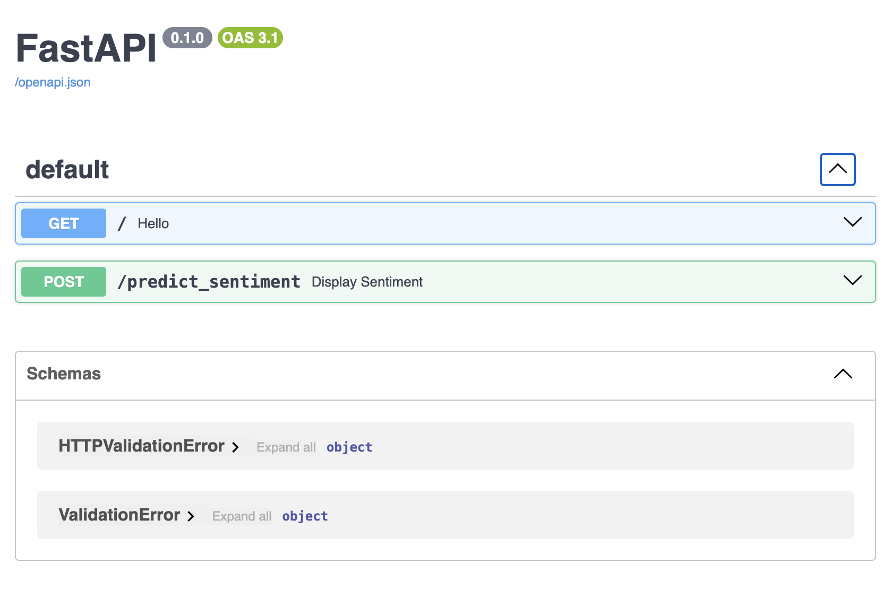

# API Sentiment Classification with roBERTa

[](LICENSE)

Here is my sentiment classification with roBERTa API using FastAPI which provides a simple and powerful interface for integrating word processing functionalities.

## Description  

With sentiment classification capabilities, my API offers the ability to integrate into decision support tools, paving the way for an infinite range of applications, from intelligent monitoring, to insight support .  



## Table of Contents

- [Getting Started](#Getting-Started)
- [Launch Application](#Launch-Application)
- [Contributing](#Contributing)
- [License](#License)  

## Getting Started  

You can't use my training model because of Github storage. But if you train your own model you can install and use my repository like this.  

```bash
git clone https://github.com/HaDock404/api-vision-futur_transport.git
cd api-vision-futur_transport
pip install -r ./packages/requirements.txt
```  

## Launch Application  

You can't use my training model because of Github storage. But if you train your own model you can install and use my repository like this.  

```bash
uvicorn api:app -—reload
```  

## Contributing

Pull requests are welcome. For major changes, please open an issue first
to discuss what you would like to change.

Please make sure to update tests as appropriate.

## License  

This project is licensed under the MIT License - see the [LICENSE](./LICENSE) file for details.